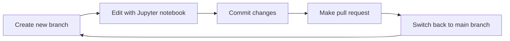

# Contributing

Thanks for contributing to the Qiskit Textbook! The general process is:

1. Install the software
2. Download a copy of the Textbook
3. Make the changes you want to see
4. Upload your changes and request to merge them into the Textbook (known as a
   _pull request_).

## 1. Installation

You'll need some software installed to work on this repository (repo). We can
install some packages for you automatically, but you must install the
following packages manually. We recommend doing this first.

> <details>
>   <summary>MacOS install instructions</summary>
>
> 
>   We recommend installing [Homebrew](https://brew.sh/) to manage
>   these installations. Once installed, you can open a terminal and run:
>   
>   ```bash
>   brew install python@3.8 git direnv vale
>   ```
>   
>   The only thing Homebrew can't install is GitHub Desktop, which we
>   recommend to first-time contributors. Please go to the [GitHub Desktop
>   download page](https://desktop.github.com/) to install manually.
>   
>   Once complete, you can skip to [the next step](#2-fork--download-the-textbook).
>   
> </details>

Software used:
- [Python 3.8](https://www.python.org/): To run Qiskit and Jupyter notebook.
- [Git](https://git-scm.com): To save and share your changes. If using Windows,
  choose to install Bash when asked by the installer.
- [Direnv](https://direnv.net/): To automatically switch environments when in
  this directory.
- [GitHub Desktop](https://desktop.github.com/) _or_ [GitHub
  CLI](https://cli.github.com/): To easily work with github.com. If you're new
  to Git, we recommend the desktop application.
- [Vale linter](https://vale.sh/): Used for one of the tests.


## 2. Fork & download the Textbook

### 2.1 Fork

For your first contribution, you'll need to _fork_ the Textbook repository by
clicking [this link](https://github.com/Qiskit/textbook/fork), or clicking the
'fork' button on the top right corner of this page. This creates a copy of the
repo, owned by your GitHub account.

### 2.2 Download

Now, you can download (clone) your forked repository. For GitHub Desktop users,
make sure you're looking at the web page for your fork (the url will be
`github.com/<your-user-name>/textbook`, _not_ `github.com/Qiskit/textbook`). Then
click the green _code_ button and choose _Open with GitHub Desktop_.


### 2.3 Setup

Next, you'll install the specific packages we use in the Textbook and
set up your environment. To set up automatically, first open a terminal in this
folder.

> **Opening a terminal in a folder**
> <details>
>   <summary>MacOS instructions</summary>
>
>   1. Open this repo folder in Finder
>   2. in Finder, select _View > Show Path Bar_ to display the path in the
>      finder window
>   3. Right click on the _textbook_ folder in the path bar and choose _Open in
>      Terminal_.
> </details>
>
> <details>
>   <summary>Windows instructions</summary>
>
>   1. Open the Git Bash console from the start menu
>   2. Navigate to this folder with the `cd` command, for example:<br><br>
>      ```bash
>      cd C:/path/to/textbook
>      ```
> </details>

with your terminal in this folder, run:

```bash
./install.sh
```

> <details>
>   <summary> What does this do? </summary>
>   <br>
>   <p>If you're interested, this script will:</p>
> 
>   <ul>
>     <li>
>       Setup a Python venv with the correct version of Python, and add a shell
>       script to automatically switch to this venv when you move to this directory.
>     </li>
>     <li>
>       Set up your IPython & Jupyter config so that your notebook outputs match
>       those already in the Textbook.
>     </li>
>     <li>
>       Set up Git commit hooks that lint the notebooks to adhere to our conventions
>       (this helps with reviewing PRs and merge conflicts).
>     </li>
>   </ul>
> </details>

This may take a while. When it's finished, you'll see `Qiskit Textbook setup
complete!`


## 3. Making changes to the Textbook




The source for each page in the Textbook is a [Jupyter
notebook](https://jupyter.org/), a file format that combines
[Python](https://www.python.org/) code,
[markdown](https://www.markdownguide.org/basic-syntax/), and rich content (e.g.
images). To contribute to the Qiskit Textbook, you must edit these
notebooks, then share your changes with us via GitHub.

### 3.1 Making a new branch

First, make a new branch named after the changes you plan on
making (for example, `fix-issue-544`).

> ℹ️ GitHub Desktop users: see [Committing and reviewing changes to your
project](https://docs.github.com/en/desktop/contributing-and-collaborating-using-github-desktop/making-changes-in-a-branch/committing-and-reviewing-changes-to-your-project).

### 3.2 Editing notebooks

Once on the appropriate branch, you can edit a notebook by navigating to this
repo in a terminal and running

```
jupyter notebook
```

This will open Jupyter notebook, which you can use to make your changes.
Check out [this video](https://youtu.be/HW29067qVWk?t=243) if you're unfamiliar
with notebooks.

The Qiskit Textbook also includes some extra features that we can't display in
the notebook editor. We use a special syntax to tell the Textbook website where
and how to insert these features. (TODO: include more about this).

### 3.3 Saving your changes

Once you've made your changes, you must save (commit) them using Git.

> ℹ️ GitHub Desktop users: see [Committing and reviewing changes to your
project](https://docs.github.com/en/desktop/contributing-and-collaborating-using-github-desktop/making-changes-in-a-branch/committing-and-reviewing-changes-to-your-project).


## 4. Make a pull request

With your changes made and committed, you can now push these changes to GitHub,
and ask us to consider incorporating them into the Textbook.

> ℹ️ GitHub Desktop users: see [Pushing changes to GitHub](https://docs.github.com/en/desktop/contributing-and-collaborating-using-github-desktop/making-changes-in-a-branch/pushing-changes-to-github)

After pushing your changes, switch back to the `main` branch
before working on a different issue.

## Testing

When you submit a pull request, we'll run some tests against your changes.
You can read more about them in the [`tests folder`](./tests).
